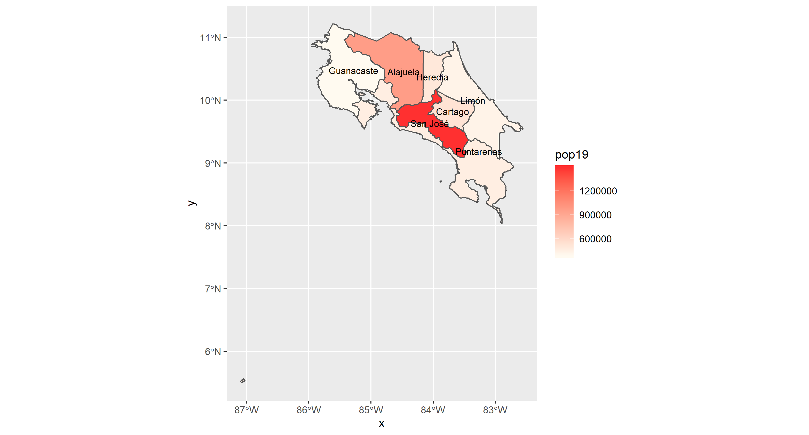
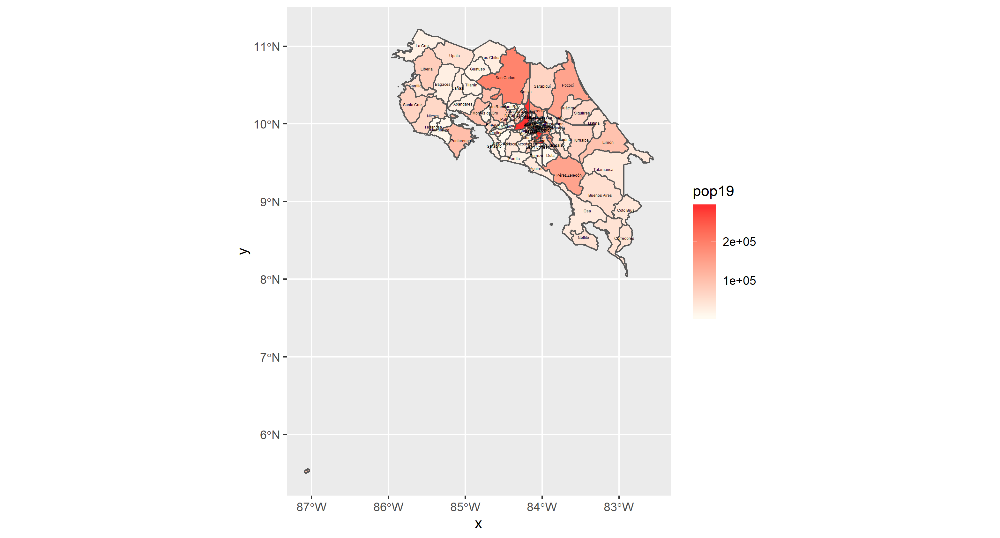
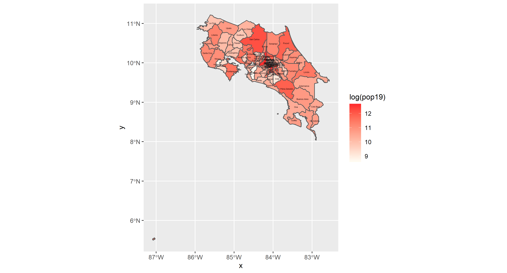
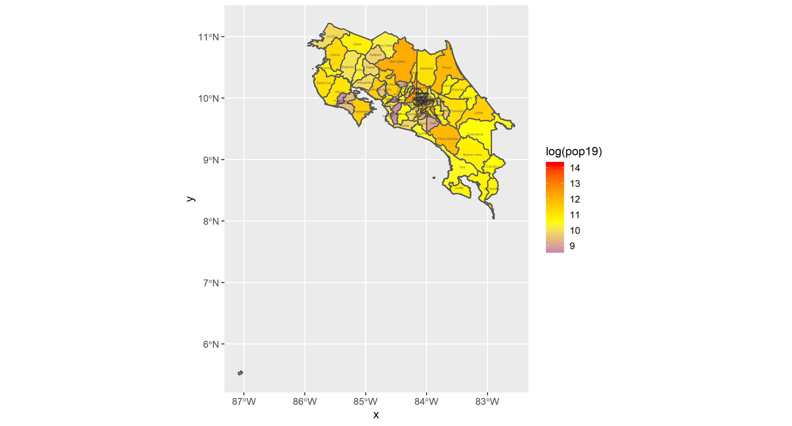
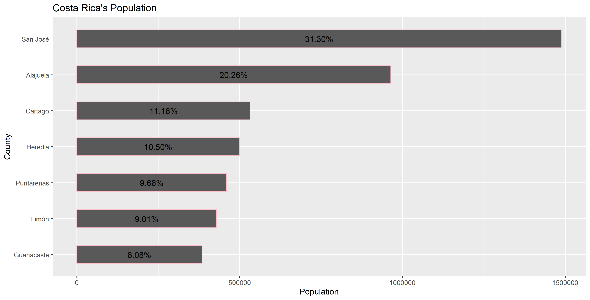
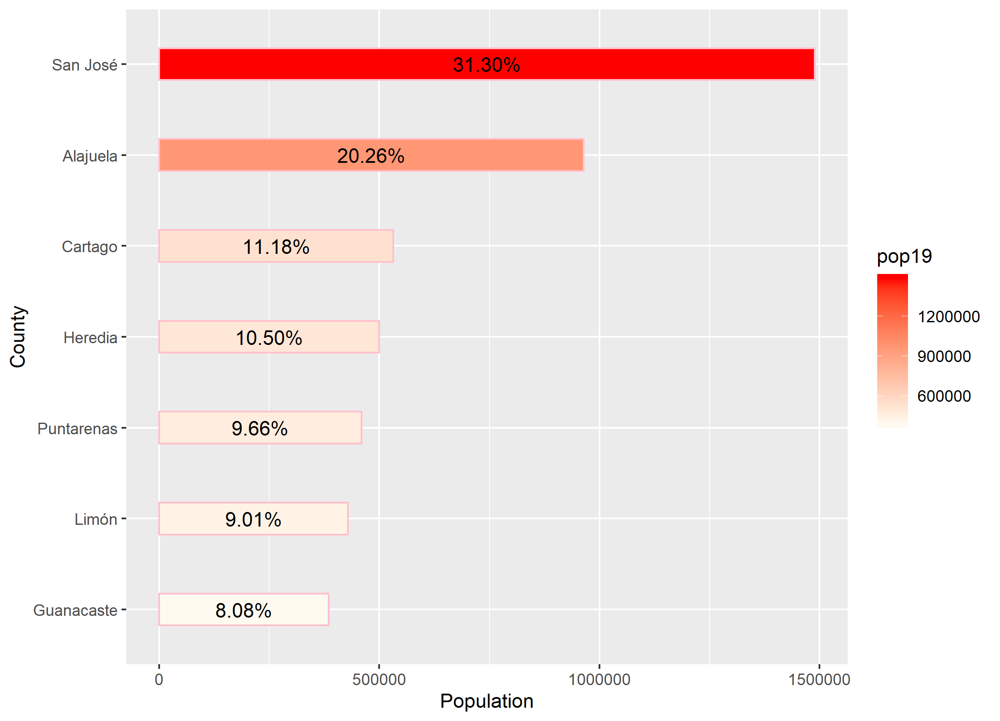
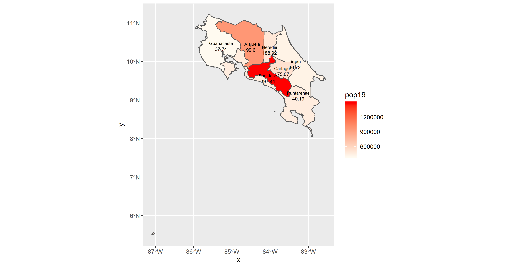
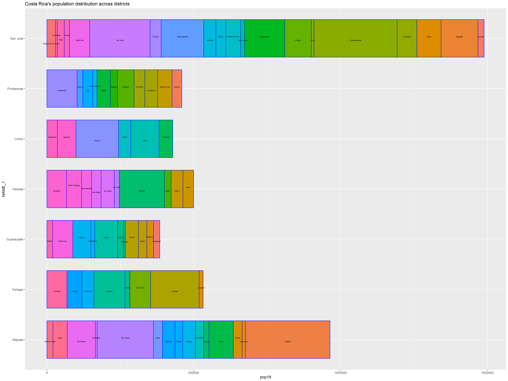

# Project 1: Costa Rica
Alyssa Nekritz

## Part 1
### Administrative Subdivisions of Costa Rica
The following image is the original outline for the subdivisions in Costa Rica. It was challenging to get the words to stop overlapping since they are bunched into one place. I did my best, and the zoom tool creates a readable, non-pixelated image. I had trouble getting the layers correct as well. I chose purple because I think it's a very underrated color and the divisions can be seen clearly.

## Part 2
### Population of Costa Rica's Provinces
The capital city has the highest population density. There are around 340,000 citizens in San Jose. There are tons of amazing cites to see, and they have a National Theatre where many tourists also like to travel fairly frequently. I also had trouble with the one dot of an island called Cocos Island. I wanted to leave it out of the graphs so I could focus on the mainland, but I couldn't completely figure it out. On other maps online/Google, they rarely show it.

### Population of Costa Rica's Districts

### Stretch Goals

Costa Rica's Districts described in terms of Log of Population

Costa Rica's Districts (Log of Populaiton) x-axis = longitude, y-axis = latitude

Costa Rica 3-D Imagery

## Part 3
### Individual Desirable
The following images demonstrate the step-by-step process towards getting the side-by-side image. The bar chart originally separates Costa Rica's counties and shows the percent population in each one. It's in a decreasing order (pareto chart style). The next image has added color scales where the lighter the color gets, the smaller the population is. The population densities map also has the lighter colors as a smaller population. Finally, after putting the charts side-by-side you can see visually where the populations are the greatst and in what areas of Costa Rica.

This image shows the population, density, and distribution of Costa Rica. I had trouble with the labeling in this graph, and my guess-and-check code edits were unsuccessful for a while.
I was fortunate throughout this entire project that Costa Rica didn't have an obscene amount of grid cells that I had to work with. I didn't have to subset anything, so that made my life MUCH easier. The outskirts (moreso near the bottom) have smaller population densities because that's where a lot of forests are. Costa Rica is known for their environmental sustainability initiatives and is planning on becoming a carbon-neutral country by 2021 (Steffen 1:2020).

### Stretch Goal
I had trouble with the words/labeling on this chart because when I tried to make the words bigger, the chart would disappear completely, so this was the best I could do. If you go to the individual page for this image, you can see the labelling really clearly.

