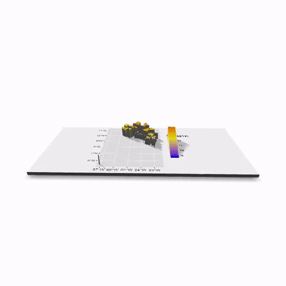
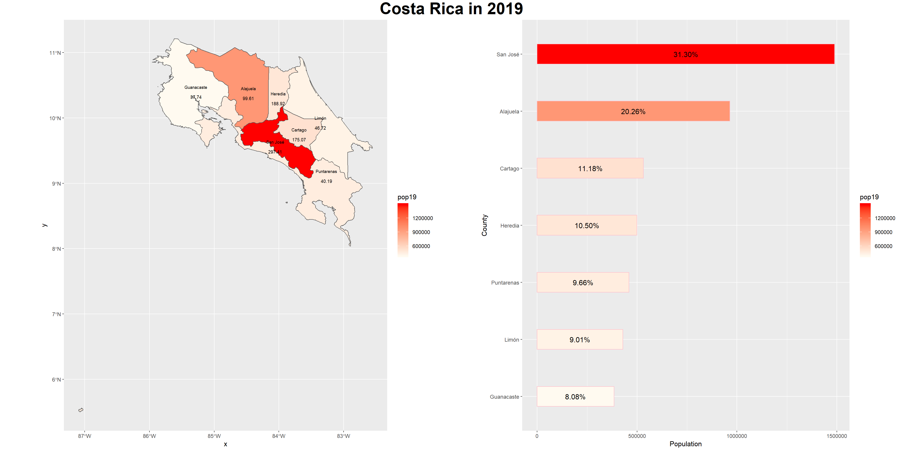

# Project 1: Costa Rica
Alyssa Nekritz

## Administrative Subdivisions of Costa Rica
The following image is the original outline for the subdivisions in Costa Rica. It was challenging to get the words to stop overlapping, but there are too many different label areas. I had trouble getting the layers correct as well. If the picture id downloaded however, you can zoom in and get a clearer view of the labelling.

## Population of Costa Rica's Counties

## Population of Costa Rica's Districts

## Stretch Goals

1. Costa Rica's Districts described in terms of Log of Population

2. Costa Rica's Districts (Log of Populaiton) x-axis = longitude, y-axis = latitude

3. Costa Rica 3-D Imagery

## Part 3
The following images demonstrate the step-by-step process towards getting the side-by-side image. The bar chart originally separates Costa Rica's counties and shows the percent population in each one. It's in a decreasing order (pareto chart style). The next image has added color scales where the lighter the color gets, the smaller the population is. The population densities map also has the lighter colors as a smaller population. Finally, after putting the charts side-by-side you can see visually where the populations are the greatst and in what areas of Costa Rica.

## Stretch Goal

