# Project 2: Costa Rica
Alyssa Nekritz

## Part 1
### Histogram

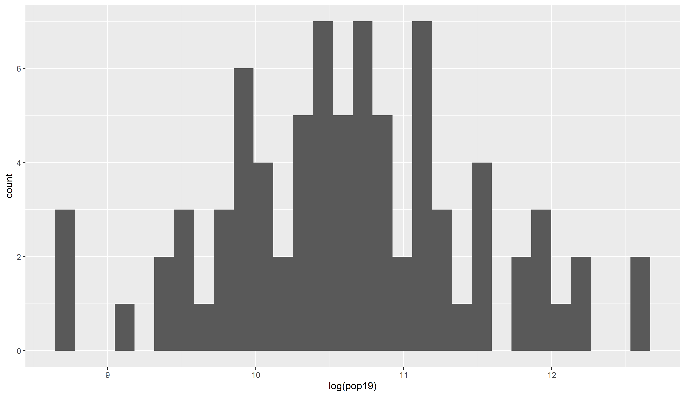

### Density

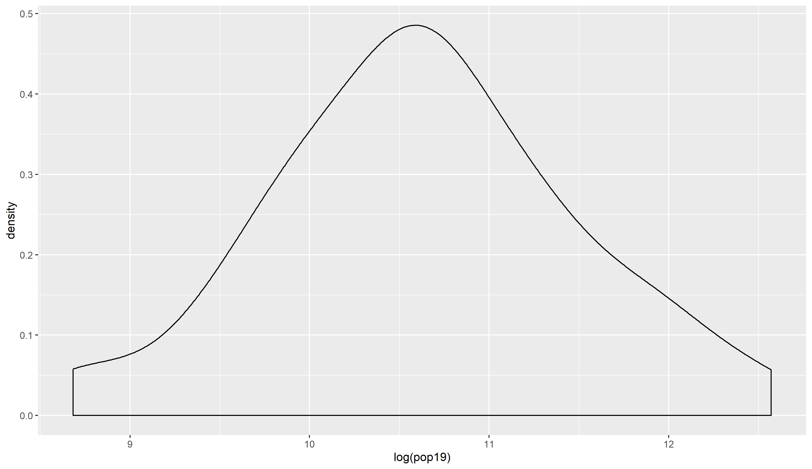

### Histogram and Density

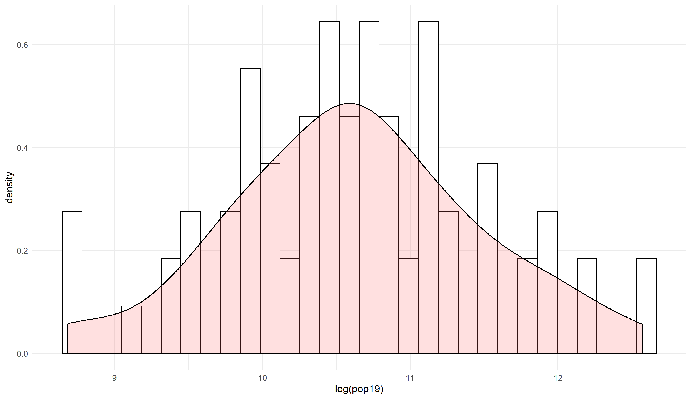

### Layered (ntl image)

### Regression Line

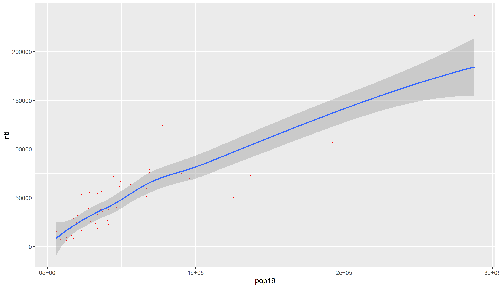

### Stretch Goal Attempt

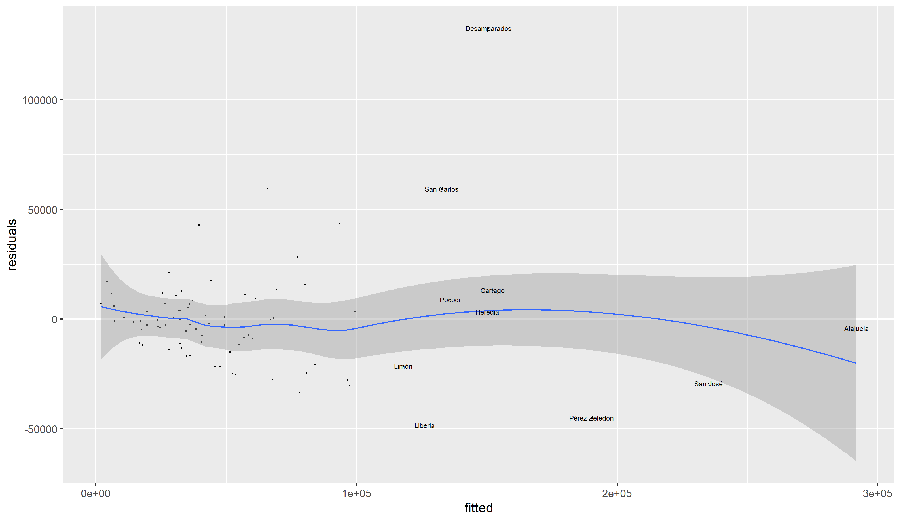

## Part 2

### Population Plot Step

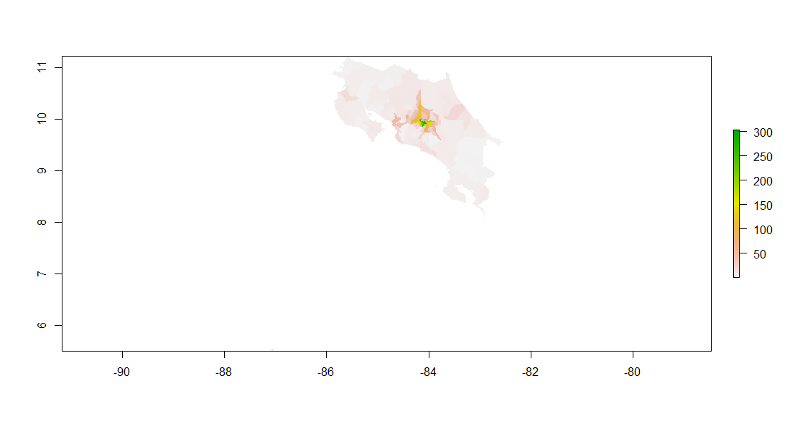

### Diff Plot Step

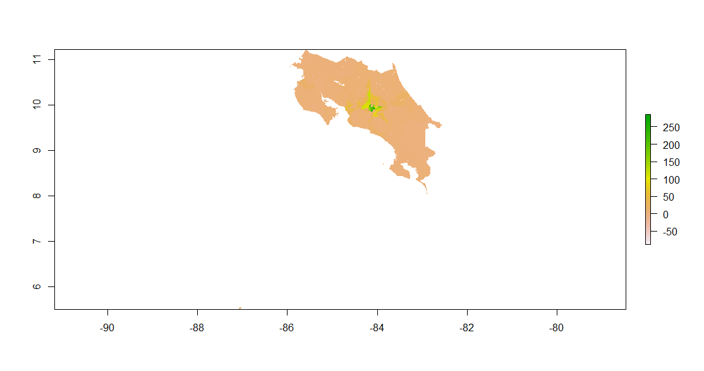

### Alajuelita Diff Plot

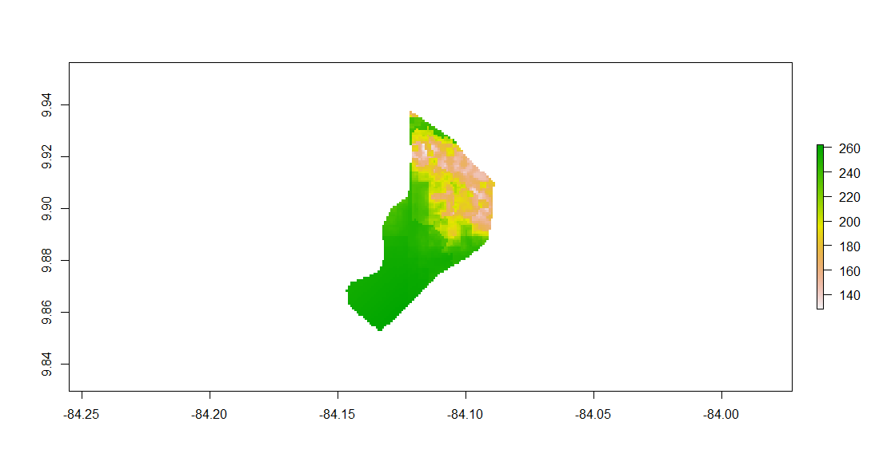

### Alajuelita Population Plot

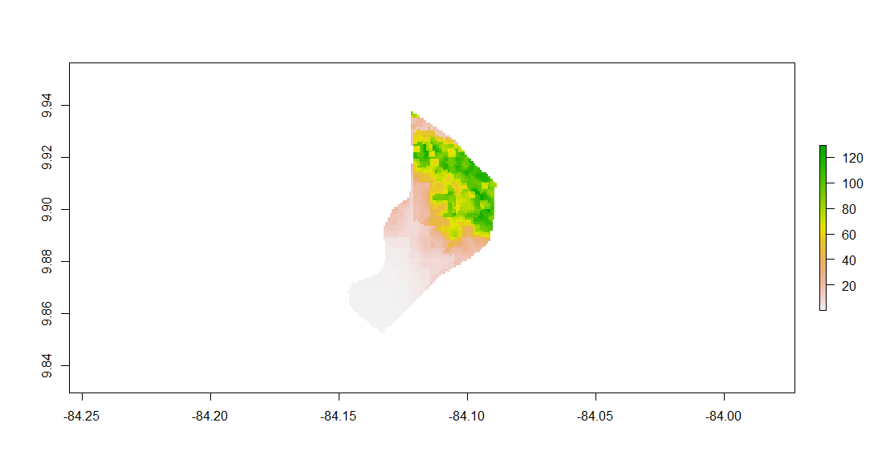

### 3D Plot

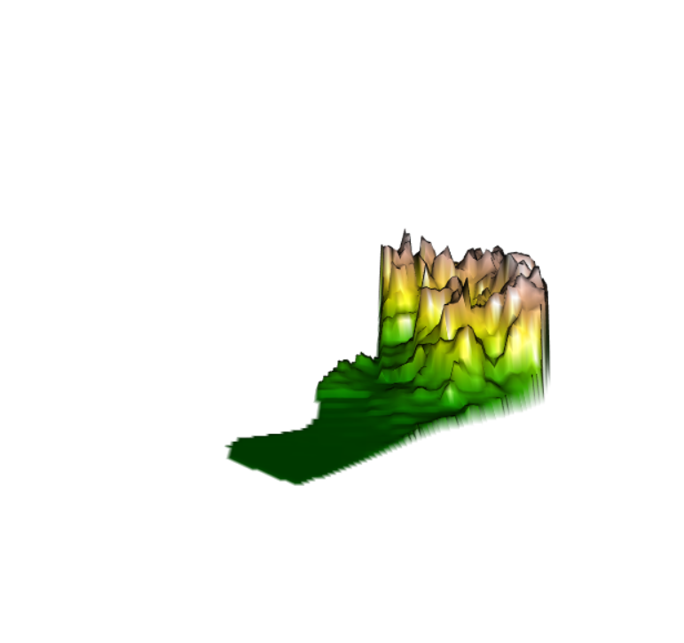

### Mapview

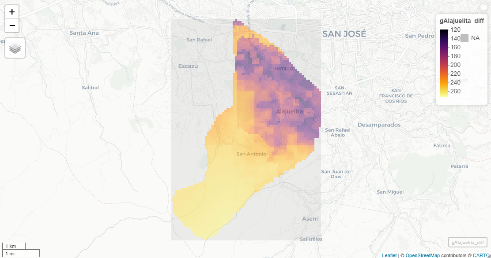

## Part 3
