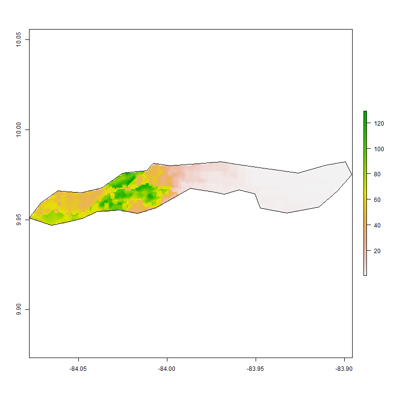
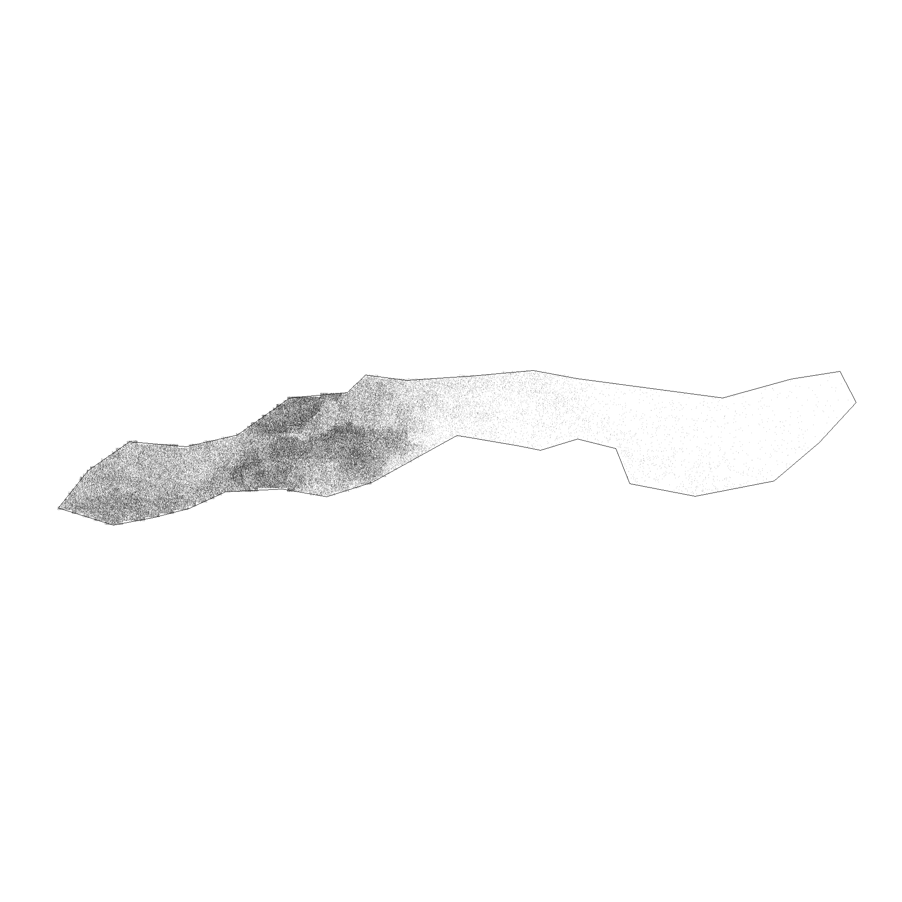
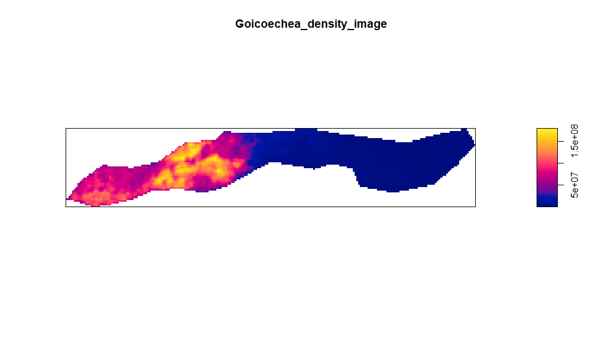
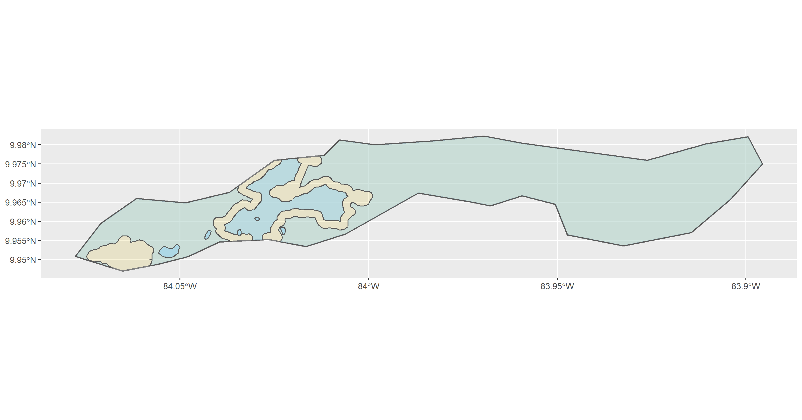
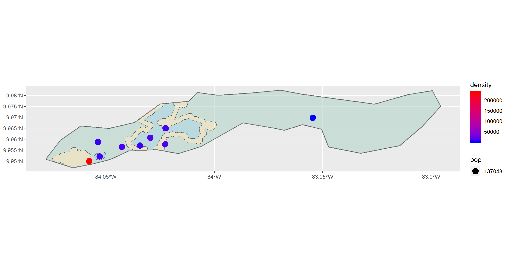

# Project 3

Alyssa Nekritz
## Part 1

### Background

For this project, I used the adm2 subdivision "Goicoechea."

Goichoechea's current population is 124, 704, and it's known for it's great weather.
It's a largy urban area with less than 3% of the population in a "rural" environment.

http://www.citypopulation.de/en/costarica/admin/108__goicoechea/

### Goicoechea pop19

^^^
That is the population per grid cell distribution in Goicoechea. The left portion is much denser than the right. It's populated because it's near the capital (San Jose). Namely, it's located in the San Jose province.

### Population Point Image

The dots represent the population persons geospatially.
dot = person
It's easier to visualize the densities this way.

### Goicoechea Density Image

^^^This image demonstrated the population using a heating/coloring scale. The blue regions are less populated and the yellow regions are the most populated.

### Contour Lines
I then added contour lines to the plot.
.png)
It was then put onto the density colored plot.

### Distinguishing Urban Areas
The next image shows a plot that seperates urban areas and settlements.

Lastly, this image shows the urbanized areas in Goicoechea. The dots represent the density.

## Part 2

TOTAL POPULATION OF GOICOECHEA ADM2 = 
Number of human settlements or urban areas = 

Description of the distribution sizes and densities

A description of the roadways and your estimate of the transportation networks level of service in comparison to the spatial distriubtion of human settlements and urban areas

A description of health care facilities and your estimate of service accessibility in comparison to the spatial distriubtion of human settlements and urban areas
