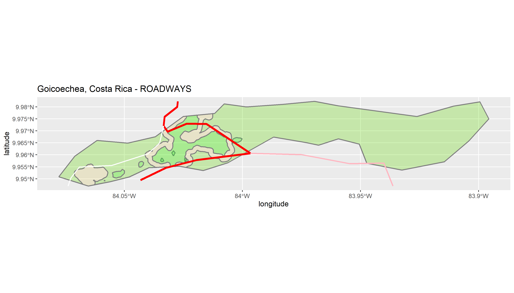
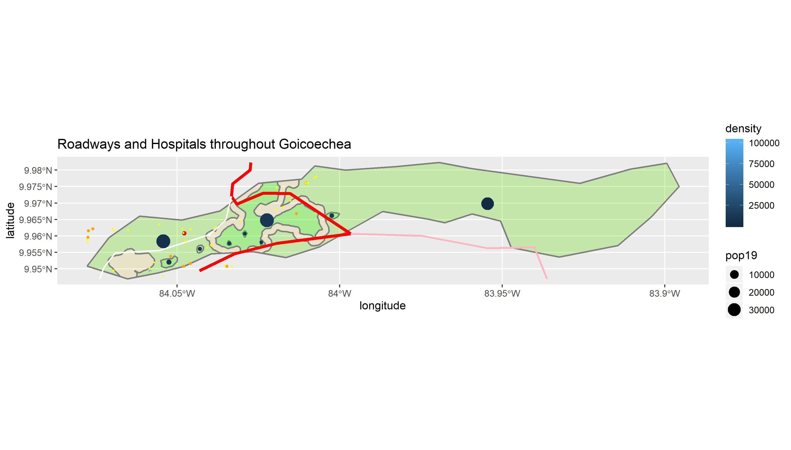

# Project 3

Alyssa Nekritz
## Part 1

### Background

For this project, I used the adm2 subdivision "Goicoechea."

Goichoechea's current population is 124, 704, and it's known for it's great weather.
It's a largy urban area with less than 3% of the population in a "rural" environment.

http://www.citypopulation.de/en/costarica/admin/108__goicoechea/

### Goicoechea pop19

^^^
That is the population per grid cell distribution in Goicoechea. The left portion is much denser than the right. It's populated because it's near the capital (San Jose). Namely, it's located in the San Jose province.

### Population Point Image

The dots represent the population persons geospatially.
dot = person
It's easier to visualize the densities this way.

### Goicoechea Density Image

^^^This image demonstrated the population using a heating/coloring scale. The blue regions are less populated and the yellow regions are the most populated.

### Contour Lines
I then added contour lines to the plot.
.png)
It was then put onto the density colored plot.

### Distinguishing Urban Areas
The next image shows a plot that seperates urban areas and settlements.

Lastly, this image shows the urbanized areas in Goicoechea. The dots represent the density.

## Part 2

TOTAL POPULATION OF GOICOECHEA ADM2 = 124,702
Number of urban areas = 11 obs., 4 variables 

Distribution sizes and densities: see the above charts in Part 1 to get visuals on the densities

### Urban Area with Roads

There were very minimal roadways. There were Primary Routes, Secondary Routes, and an Unknown. There didn't seem to be enough roads, but there was limited data given to begin with about the road system in Costa Rica. There were three primary roads (red) one secondary (pink) and one unknown (white). 

As for transportation, I think there is a lot of room for improvement, whether it be the data or development in order to get people to move around easier. I don't think the goven roads are very sophisticated.

### Roadways and Hospital-type Centers

The only red dot is the only hospital in the entire area.
The orange dots are clinics.
The yellow small dots represent doctors, pharmacies, and dentists.

The healthcare facility breakdown:
clinics = 9
dentists = 14
doctors = 2
hospitals = 1
pharmacies = 18

There's a lack to adequate health care in Goicoechea. There should be another hospital near the more urban dense population near the middle of the map. I think there are a lot of accessible cinics, but there's not enough proportionally for the nearly 125K population.There are more hotpitals near urban areas, which makes sense.
