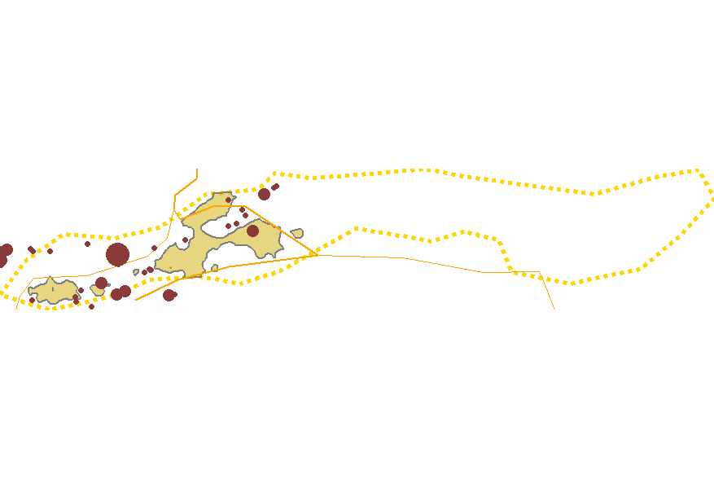
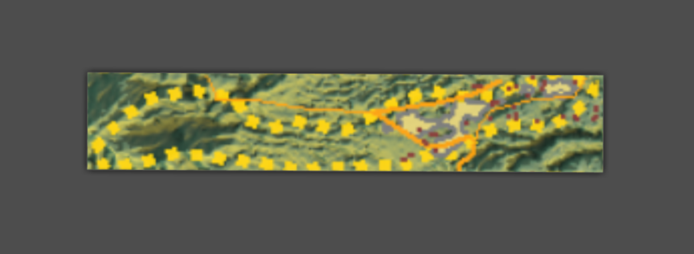
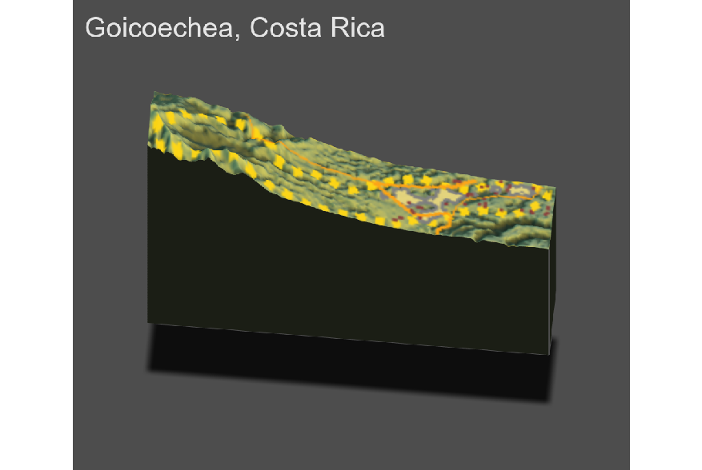

# Project 4

Alyssa Nekritz

### Deliverable

How has topography appeared to have impacted the development of urban areas?

Topography impacts the development of urban areas because of accessibility and resources. If there are more resources then there are more ways to use the land and more demand to get to that land. That means there's a motive for people to develop a stable home by a boutiful resource. Additionally, it's also easier to get and develop urban areas when the land is easier to build on so if you are in a mountinous area, it would be harder to build. In my opinion, Goicoechea has topography that's suitable for urban area development. The area within Goicoechea is clearly the areas with the hospitals and roadway intersections. This subdivision is near the city as well, which means the population closer to the city is more dense and the areas closer fit the urban area definition better. Suitable topography is key for motivation for development, accessibility to other areas and resources.

How has topography appeared to have impacted the development of transportation facilities?

Topography influences transportation because transport has to work with the land. That means the direct line from A to B might not be straight given the topography. It might have to go around a certain area. For example, if there's a lake, the roads must go around it so the direct tranport line is influenced by the topography.

How has topography appeared to have impacted the location of health care facilities?

Has producing your three-dimensional map resulted in an interpretion that is different from your previous analysis?

According to the 3-D image, the land seems to dip lower on the right side. This tells me that the land heights are diferent and the less dense areas are on higher ground. The urban areas seem to be in a part of a vally. This 3-D map helped me vidualize what the area looks like from afar. A 2-D image wouldn't show the depths of the region, and this added information can be another way to explain the density differences. A higher elevation now tells me that the density will be lower. I have an added interpretation that was realized because of the 3-D image.

### Images
##### Attempt 1:

##### Actual Image Overlayed:

##### Arial View of Goicoechea:

##### Final 3-D image:

